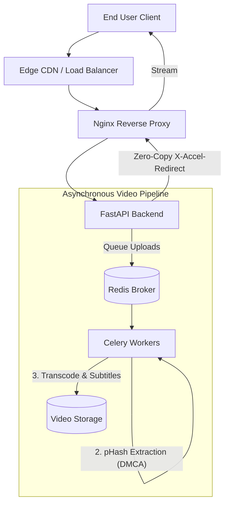

# Phryco 

**Sovereign, Ethical Video Infrastructure for Niche Communities**

Phryco is a modern, high-performance video streaming platform built with Python, FastAPI, and Vanilla JS. Unlike global big-tech streaming giants, Phryco is explicitly designed to be self-hosted by high-trust niche communities and enterprises. It provides sovereign identity, mathematically enforced ethical content filtering (Halal Mode), and lightning-fast edge delivery.

## 🚀 Key Features

- **Sovereign Video Streaming**: Enterprise-grade adaptive bitrate streaming with Nginx `X-Accel-Redirect` zero-copy delivery and Edge CDN support.
- **Mathematical Halal Mode**: Automated audio spectrogram checking via FFmpeg (`astats`) to detect and reject non-compliant instrumental music at the Celery pipeline level, bypassing fragile LLM text prompts.
- **Perceptual Moderation**: pHash-based frame hashing and automated DMCA duplication blocking.
- **Phryco Sovereign Identity**: A built-in OAuth 2.0 provider allowing communities to act as their own secure SSO identity hub for third-party tools.
- **Community Phrybucks (PB)**: A strictly reputation-based, closed-loop virtual economy powered by a robust anti-Sybil ledger. Defends against botnets with algorithmic reward decay and VaultGuard fingerprinting.

## 🏗 Architecture



## 🛠 Tech Stack

- **Backend**: FastAPI, SQLAlchemy, Celery, Redis, SQLite/Supabase PostgreSQL
- **Frontend**: Vanilla JavaScript (ES6+), HTML5, custom CSS
- **Infrastructure**: FFmpeg, Nginx, Uvicorn, Celery Beat

## 📖 Quick Start

1. **Clone & Setup Environment**
   ```bash
   git clone https://github.com/phryco/phryco.git
   cd phryco/backend
   python -m venv venv
   source venv/Scripts/activate
   pip install -r requirements.txt
   ```

2. **Start the Infrastructure**
   Start your local Redis server on port `6379`.

3. **Run the Backend**
   ```bash
   uvicorn main:app --reload --port 8000
   ```

4. **Run the Celery Worker**
   ```bash
   celery -A worker.celery_app worker --loglevel=info --concurrency=2
   ```

## ⚖️ License

Phryco is released under a **Special Ethical License**. Please see the [LICENSE.md](LICENSE.md) file for critical usage restrictions regarding content compliance.
